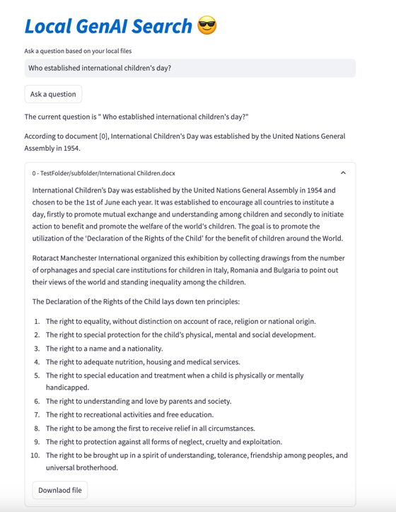

# Local-GenAI Search - Local generative search

Local GenAI Search is your local generative search engine 
based on Llama3 model that can run localy on 32GB 
laptop or computer (developed with MacBookPro M2 with 32BG RAM).

The main goal of the project is that it lets user ask questions 
about content of their local files, which it answers in 
concise manner with referencing relevant documents that can be 
then opened. 



The engine is using MS MARCO embeddings for semantic search,
with top documents being passed to  Llama 3 model. 

By default, it would work with NVIDIA API, and use 70B parameter Llama 3 
model. However, if you used all your NVIDIA API credits or 
do not want to use API for searching your local documents, 
it can also run locally, using 8B parameter model. 


## How to run

In order to run your Local Generative AI Search (given you have sufficiently string machine to run Llama3), you need to 
download the repository:

````
git clone https://github.com/nikolamilosevic86/local-gen-search.git
````
You will need to install all the requirements:
```commandline
pip install -r requirements.txt
```

You need to create a file called ``environment_var.py``, and put there
your HuggingFace API key. The file should look like this:

```python
import os

hf_token = "hf_you_api_key"
```

API key can be retrieved at ``https://huggingface.co/settings/tokens``.
In order to run generative component, you need to request
access to Llama3 model at ```https://huggingface.co/meta-llama/Meta-Llama-3-8B-Instruct```

The next step is to index a folder and its subfolders containing
documents that you would like to search. You can do it using
the ``index.py`` file. Run

```commandline
python index.py path/to/folder
```
As example, you can run it with TestFolder provided:
```commandline
python index.py TestFolder
```
This will create a qdrant client index locally and index all the files
in this folder and its subfolders with extensions ```.pdf```,```.txt```,```.docx```,```.pptx```

The next step would be to run the generative search service.
For this you can run:

```commandline
python uvicorn_start.py
```

This will start a local server, that you can query using postman, 
or send POST requests. Loading of models (including 
downloading from Huggingface, may take few minutes, 
especially for the first time). There are two interfaces:
```commandline
http://127.0.0.1:8000/search
```

```commandline
http://127.0.0.1:8000/ask_localai
```

Both interfaces need body in a format:

```commandline
{"query":"What are knowledge graphs?"}
```
and headers for Accept and Content-Type set to ``application/json``.

Here is a code example:

```python
import requests
import json

url = "http://127.0.0.1:8000/ask_localai"

payload = json.dumps({
  "query": "What are knowledge graphs?"
})
headers = {
  'Accept': 'application/json',
  'Content-Type': 'application/json'
}

response = requests.request("POST", url, headers=headers, data=payload)

print(response.text)
```
Finally, streamlit user interface can be started in the following way:
```commandline
streamlit run user_interface.py
```

Now you can use the user interface and ask question that will be 
answered based on the files on your file system.

## Technology used

- Llama3 8B
- Langchain
- Transformers
- MSMarco IR embedding models
- PyPDF2

## Contributors

* [Nikola Milosevic](https://github.com/nikolamilosevic86)